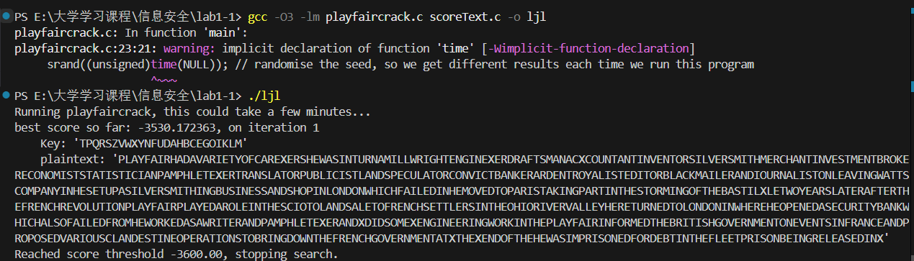
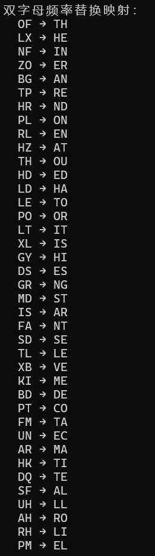
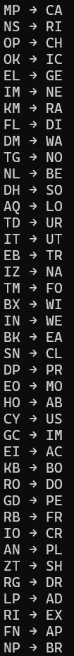
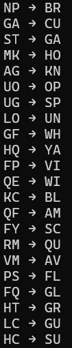
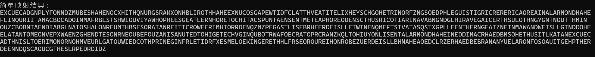

## 实验报告
### 1. 实验目的
1. 了解古典密码中playfire的加密和解密运算
2. 了解古典密码体制
3. 掌握古典密码的破译方法

### 2. 实验原理
- 加密规则：
  - 将明文按双字母两两分组，相同字母中间插入X。如BALLOON->BA LX LO ON
  - 若字母在矩阵同一行，替换为右侧字母
  - 若字母在同一列，替换为下方字母
  - 否则形成矩阵，分别用与其同行对方字母列的字母替换
- 解密规则：
  与加密类似，只需要将右移改为左移，下移改为上移
- 模拟退火算法
  - 先随机生成初始密钥然后该密钥解密明文的得分
  - 迭代搜索。在当前密钥基础上小幅修改得到新密钥。然后用新密钥解密密文再重新打分
  - 计算得分差ΔF，若ΔF>0则接受，若ΔF<0，则以概率接受

### 3. 实验环境
- 操作系统：windows11
- 编程语言：C语言

### 4. 实验内容
编写C语言程序实现Playfair密码的破解。先随机生成一个密钥，然后使用该密钥解密密文计算铭文得分。接着在前密钥基础上小幅修改得到新密钥，继续打分。停止方法：设置一定迭代次数或者得分达到预设阈值停止。

### 5. 实验思路
- playfireDecipher解密函数
  - 每次读取两个字母,如果其中包含J，则统一替换为I
    ```
    for (i = 0; i < len; i += 2)
    ```
    ```
    char a = text[i];
    char b = text[i+1];
    if(a == 'J') a = 'I';
    if(b == 'J') b = 'I';
    ```
- 定位每个字母在密钥矩阵中的位置，计算所在行列编号
  ```
  int a_index = strchr(key, a) - key;
  int b_index = strchr(key, b) - key;
  a_row = a_index / 5;
  a_col = a_index % 5;
  b_row = b_index / 5;
  b_col = b_index % 5;
  ```
- 根据Playfair解密规则处理
  ```
  if(a_row == b_row){ // 同一行
      result[i] = key[a_row*5 + (a_col + 4)%5];
      result[i+1] = key[b_row*5 + (b_col + 4)%5];
  }
  else if(a_col == b_col){ // 同一列
      result[i] = key[((a_row + 4)%5)*5 + a_col];
      result[i+1] = key[((b_row + 4)%5)*5 + b_col];
  }
  else{ // 不同行不同列
      result[i] = key[a_row*5 + b_col];
      result[i+1] = key[b_row*5 + a_col];
  }
  ```
- playfireCrack模拟退火函数
  - 初始化，使用初始密钥进行解密和打分
    ```
    strcpy(parentKey, bestKey);
    playfairDecipher(parentKey, text, plaintext, len);   
    parentScore = (float)scoreTextQgram(plaintext, len);     
    maxScore = parentScore; 
    strcpy(bestKey, parentKey);
    ```
  - 模拟退火主循环，从高温逐步降温
    ```
    for (float T = TEMP; T >= 0; T -= STEP) {
        // 在每个温度下执行 COUNT 次扰动尝试
        for (i = 0; i < COUNT; i++) {
            modifyKey(childKey, parentKey);                        
            playfairDecipher(childKey, text, plaintext, len);    
            childScore = (float)scoreTextQgram(plaintext, len);   
            dF = childScore - parentScore;

            // 接受准则：
            // 如果新密钥得分更高（更像英文），直接接受
            // 如果更差，也可能以一定概率接受（模拟退火核心），避免陷入局部最优
            if (dF > 0 || ((float)rand() / RAND_MAX) < exp(dF / T)) {
                strcpy(parentKey, childKey);        // 更新当前密钥为新密钥
                parentScore = childScore;           // 更新当前得分

                // 如果新密钥得分是目前最优，则更新最优解
                if (childScore > maxScore) {
                    maxScore = childScore;
                    strcpy(bestKey, childKey);
                }
            }
        }
    }
    ```

### 6. 实验结果

'PLAYFAIRHADAVARIETYOFCAREXERSHEWASINTURNAMILLWRIGHTENGINEXERDRAFTSMANACXCOUNTANTINVENTORSILVERSMITHMERCHANTINVESTMENTBROKERECONOMISTSTATISTICIANPAMPHLETEXERTRANSLATORPUBLICISTLANDSPECULATORCONVICTBANKERARDENTROYALISTEDITORBLACKMAILERANDIOURNALISTONLEAVINGWATTSCOMPANYINHESETUPASILVERSMITHINGBUSINESSANDSHOPINLONDONWHICHFAILEDINHEMOVEDTOPARISTAKINGPARTINTHESTORMINGOFTHEBASTILXLETWOYEARSLATERAFTERTHEFRENCHREVOLUTIONPLAYFAIRPLAYEDAROLEINTHESCIOTOLANDSALETOFRENCHSETTLERSINTHEOHIORIVERVALLEYHERETURNEDTOLONDONINWHEREHEOPENEDASECURITYBANKWHICHALSOFAILEDFROMHEWORKEDASAWRITERANDPAMPHLETEXERANDXDIDSOMEXENGINEERINGWORKINTHEPLAYFAIRINFORMEDTHEBRITISHGOVERNMENTONEVENTSINFRANCEANDPROPOSEDVARIOUSCLANDESTINEOPERATIONSTOBRINGDOWNTHEFRENCHGOVERNMENTATXTHEXENDOFTHEHEWASIMPRISONEDFORDEBTINTHEFLEETPRISONBEINGRELEASEDINX' 

### 7. 实验总结
本实验实现了模拟退火解密playfire的过程。模拟退火算法适用于在复杂的搜索空间中寻找全局最优解，通过不断扰动密钥并评估解密效果逐步找到最接近的密钥。

## 拓展实验
### 1. 实验思路
- 把密文拆分成双字母对并统计每一个双字母对出现频率。通过extractBigramFreqs()实现
- 列举英文中常见的双字母组合（可查）
- 做频率映射，即密文里出现频率最高的组合对应英文中最常见的双字母组合
- 构建替换映射表之后扫描整个密文一组组替换
  
### 2. 实验结果
密文：RIGAUNLPGNANYFPLHRZMUBDSLDLXTGCXGYOFQNTDGSKMKXPLHBRHAHOFLDLXEXNUPTSGFNEWHKDFSNHZOFXBHZLTPMIXLXYSOPGOLXEBNFPOFZGRSOHDPHTLLCXLHKHTOKTPTPNSMPPOBKNFSFISEOHRLDLXPSNFRMNSLTQFEIKBMPRONFARRBKCMDZTQETHFPHQGFUOLXDSELHZTLAGMKTPLEOPLTEIUGLOFMRLSDFAKIDQFNMKTPTHRLFYOFCYNSPTHKISNFVMHOGRHRFQGYKMXBSTOKZOOFHCAQOFGRYGFATGITOFMIFATHZCKBBNFMRLFLHOGLIZLEZTSFPLTPUMOFBSDSPOHZBGTPLTOKAHINZOGCGYPORDRLQZMZGDSTMDRHSDNPLXZOBDXLUHETBXIMNQKIFTMDVAFMSQMDXGANTLRLOFZOGRBKTZIMNFARDMHRINXLUHGTHRROLXPMHZBGTOKIPLXBPXDMRLZGLXHRDQDHNRIMTHNLFOUZBGXLBGITHDLEGYGEDQOPVGNFQUBOEBDMTMUNKMLEDPIOBGZKQLLEGYUYPLRHSDFASFISEOHRLDLXNFEDFLARIOLDHDBMDHLXOFCYLTLKHZBGRIGAUNLPOFNISLLEZOGCPLPOTGHMXBTDLGHZTHBXHDPTOFDPNFEGNFFRTLTIRGFXDSKIAQEKNFELTPOFHLRBSDPOTHTPIHPLAHNLZUZOBDXLUHBHIZLXAOHDSNRZZOLDHDNLNPBGBGYUPMISPLTMDHAULTELHPOFZOBDRLHRQSMPTHCGOFESLRGDRGFLDZ
替换关系：



明文：
