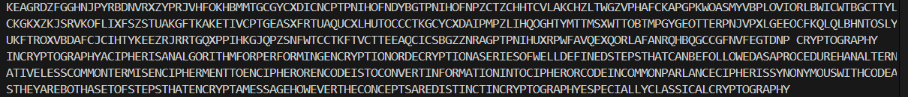

## 实验报告
### 1. 实验目的
1.了解古典密码中的加密和解密运算；
2.了解古典密码体制；
3.掌握古典密码的统计分析方法。

### 2. 实验原理
Vigenere密码是一种提高单字母表密码安全性的思路之一。解密公式为：
    ```
    Pi = (Ci - Ki + 26) mod 26
    ```
其中Pi表示明文字符，Ci表示密文字符，Ki表示密钥字符。密钥根据明文长度进行循环使用

### 3. 实验环境
- 操作系统：windows11
- 编程语言：C语言

### 4. 实验内容
编写C语言程序实现Vigenere解密。从标准输入读取密文和密钥，解密后输出明文。

### 5. 实验思路
- 定义常量和变量
  ```
  #define MAX_TEXT_LEN 5000
  char ciphertext[MAX_TEXT_LEN];
  char key[1000];
  char plaintext[MAX_TEXT_LEN];
  ```
  设置最大密文长度并分配存储密文、密钥、解密结果的数组
- 读取输入
  ```
  scanf("%s %s", ciphertext, key);
  ```
  从标准输入读取密文和密钥，按空格分隔
- 解密函数
  - 根据密文长度补齐密钥长度
    ```
    char k = key[i % keyLen] - 'A';
    ```
  - 根据模运算还原
    ```
    for (int i = 0; i < len; i++) {
        char c = ciphertext[i] - 'A';
        char k = key[i % keyLen] - 'A';
        plaintext[i] = ((c - k + 26) % 26) + 'A';
    }
    ```
- 调用函数并输出结果
  ```
  vigenereDecrypt(ciphertext, key, plaintext); // 调用函数
  printf("%s\n", plaintext);
  ```

### 6. 实验结果

KEAGRDZFGGHNJPYRBDNVRXZYPRJVHFOKHBMMTGCGYCXDICNCPTPNIHOFNDYBGTPNIHOFNPZCTZCHHTCVLAKCHZLTWGZVPHAFCKAPGPKWOASMYVBPLOVIORLBWICWTBGCTTYLCKGKXZKJSRVKOFLIXFSZSTUAKGFTKAKETIVCPTGEASXFRTUAQUCXLHUTOCCCTKGCYCXDAIPMPZLIHQOGHTYMTTMSXWTTOBTMPGYGEOTTERPNJVPXLGEEOCFKQLQLBHNTOSLYUKFTROXVBDAFCJCIHTYKEEZRJRRTGQXPPIHKGJQPZSNFWTCCTKFTVCTTEEAQCICSBGZZNRAGPTPNIHUXRPWFAVQEXQORLAFANRQHBQGCCGFNVFEGTDNP CRYPTOGRAPHY 
<br>
<br>
INCRYPTOGRAPHYACIPHERISANALGORITHMFORPERFORMINGENCRYPTIONORDECRYPTIONASERIESOFWELLDEFINEDSTEPSTHATCANBEFOLLOWEDASAPROCEDUREHANALTERNATIVELESSCOMMONTERMISENCIPHERMENTTOENCIPHERORENCODEISTOCONVERTINFORMATIONINTOCIPHERORCODEINCOMMONPARLANCECIPHERISSYNONYMOUSWITHCODEASTHEYAREBOTHASETOFSTEPSTHATENCRYPTAMESSAGEHOWEVERTHECONCEPTSAREDISTINCTINCRYPTOGRAPHYESPECIALLYCLASSICALCRYPTOGRAPHY

### 7. 实验总结
本实验实现了Vigenere解密过程。利用模运算%keyLen实现密钥重复功能，利用模运算Pi = (Ci - Ki + 26) mod 26实现解密。要注意的是设置的数组大小和要处理的密文长度之间的大小。如果密文更长，要相应增加MAX_TEXT_LEN的值。