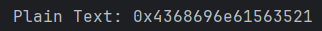
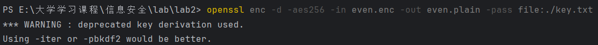

## 实验报告
<p align="center">
  
</p>

<br><br><br>

<div style="margin-left: 20%; font-size: 28px; line-height: 2;">
  课程名称：<span style="border-bottom: 1px solid black; padding: 0 24px;">信息安全</span><br>
  学　　院：<span style="border-bottom: 1px solid black; padding: 0 24px;">软件学院</span><br>
  专　　业：<span style="border-bottom: 1px solid black; padding: 0 24px;">软件工程</span><br>
  姓　　名：<span style="border-bottom: 1px solid black; padding: 0 38px;">李佳璐</span><br>
  学　　号：<span style="border-bottom: 1px solid black; padding: 0 0px;">22302010078</span><br>
</div>

<br><br>

<p style="text-align: center; font-size:20px;">
  开课时间 <u>2024</u> 至 <u>2025</u> 学年第 <u>二</u> 学期
</p>

<br><br>
<br><br>


### 一、 实验目的
1. 实现DES算法
2. 理解AES算法的作用

### 二、实验内容
1. DES加密解密实现过程
   - 初始置换（IP）：对输入的64位明文密文块执行固定置换，使用IP表控制明文比特的排列顺序。通过permutation_by_table(block, block_len, table) 函数通用实现，支持任意置换表
   - 密钥调度：将64位密钥通过PC1表压缩为56位后，拆分为左右两半各28位。分别进行若干次循环左移，共生成16对子密钥。再通过PC2表将每一对合并的56位密钥压缩为48位轮密钥
   - 轮函数：在每轮中，对右半部分R进行以下操作 
     - 1. 使用扩展置换表E，将R从32位扩展为48位 
     - 2. 与对应的48位轮密钥异或 
     - 3. 拆分为8组6位二进制，送入对应的S盒查表，S盒输出为4为，总共拼成32位 
     - 4. 最后执行P表置换得到新的右半部分，左半部分与其异或作为下一轮输入。最终将L和R交换位置合并，并进行你初始置换，得到最终明文密文
   - 解密过程：与加密过程一致，只需要将16轮轮密钥使用相反顺序应用
2. AES解密过程
   - DES解密作为密钥提取：使用提供的密钥对密文进行DES解密，将结果转换为字符串，作为AES解密的口令
   - 使用OpenSSL进行AES解密：将DES解密结果写入文本文件，然后使用openssl enc命令执行AES-256解密，还原原始明文文件

### 三、实验步骤
1. 实现permutation_by_table：DES种涉及多种置换操作（IP、PC1、PC2、E、P等）通过调用函数可以减少代码量
   > 该函数接受一个待置换的整数block，其比特长度block_len及置换表table，逐比特映射生成新序列
2. 实现generate_round_keys:
   > 生成每一轮的C和D，模拟DES种密钥调度的位移机制

   > 将每一轮生成的Ci和Di拼接为56位数据块，平通过PC2表进行压缩置换
   ```
   for i in range(1, 17):
    Ci, Di = round_keys[i]
    CD = (Ci << 28) | Di
    round_keys[i] = permutation_by_table(CD, 56, PC2)
   ```
3. 实现轮函数round_function
   > 异或轮密钥
   ```
   Ri ^= Ki
   ```
   > 拆分为8个6位小块
   ```
   blocks = [(Ri >> (42 - 6 * i)) & 0b111111 for i in range(8)]
   ```
   > 依次输入8个S盒，每个S盒产生4位输出，合并为32位
   ```
   for i in range(8):
    row = ((block >> 5) << 1) | (block & 1)
    col = (block >> 1) & 0b1111
    sbox_out = (sbox_out << 4) | Sboxes[i][row * 16 + col]
   ```
   > 经过P表置换生成新的右半部分
   ```
   Ri = permutation_by_table(sbox_out, 32, P)  # P置换
   ```
4. 实现encrypt
   > 明文先经IP表初始置换拆分位L0、R0，在16轮种不断交替执行
   ```
   L_last = L0
   R_last = R0
   for i in range(1, 17):  
    Li = R_last
    Ri = L_last ^ round_function(R_last, round_keys[i])
    L_last, R_last = Li, Ri
   ```
5. 解密
   ```
   import binascii
   key = int(binascii.hexlify(b'FudanNiu') , 16)
   #cipher_text_odd = 0x9b99d07d9980305e
   cipher_text_even = 0x6f612748df99a70c

   #decrypt(cipher_text_odd,key)
   decrypt(cipher_text_even,key)
   ```
6. 使用DES解密结果作为AES密钥解密
   将DES解出字符写入文件key.txt，使用如下OpenSSL命令解密even.enc文件，得到even.plain
   ```
   openssl enc -d -aes256 -in even.enc -out even.plain -pass file:./key.txt
   ```

### 四、实验结果及分析
1. DES解密结果

转换成字符串为：ChinaV5!
将内容存储进key.txt
2. 使用key.txt解密AES

结果为：After screenshots of his WeChat messages were shared on Chinese forums and gained huge attention, the supervision department summoned him to talk, where he was blamed for leaking the information. On 3 January 2020, police from the Wuhan Public Security Bureau investigated the case and interrogated Li, giving him a warning notice and censuring him for "making false comments on the Internet". He was made to sign a letter of admonition promising not to do it again. The police warned him that if he failed to learn from the admonition and continued to violate the law he would be prosecuted.

### 五、实验总结
本次实验通过对DES算法的底层实现以及对AES解密流程的掌握，使我对对称加密算法的基本原理和实际应用有了更深入的理解。在实现 DES 加解密过程中，我深入理解了初始置换、密钥调度、S盒代换等核心步骤。在实现generate_round_keys和round_function等函数时，深入分析了位运算、查表替换、轮密钥构造等底层逻辑，提升了对加密算法如何编程的理解。在将DES解密的结果作为AES解密的口令过程中，我掌握了如何利用OpenSSL命令行工具进行加密数据的解密。

